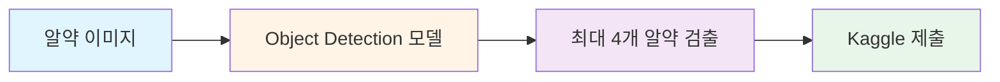
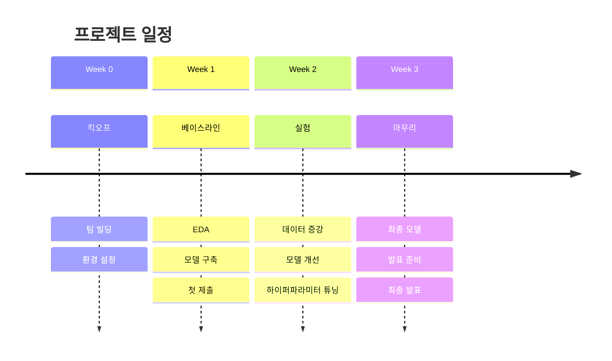
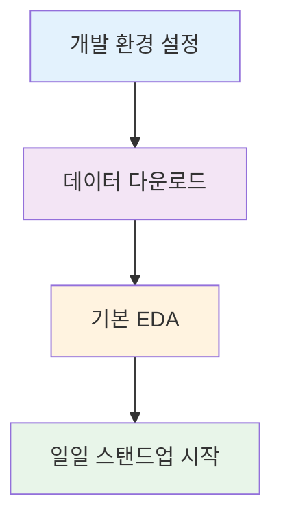
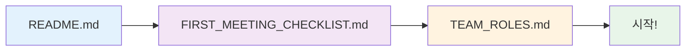
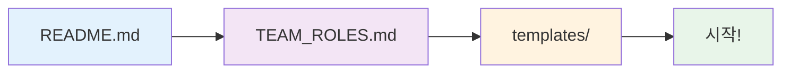
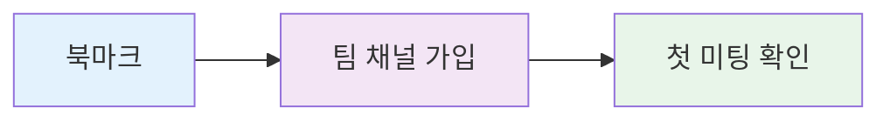

# 빠른 시작 가이드

<div align="center">


**코드잇 8팀 초급 프로젝트를 30분 안에 시작하세요**

</div>

---

## 프로젝트 한눈에 보기



<table>
<tr>
<th>항목</th>
<th>내용</th>
</tr>
<tr>
<td><b>목표</b></td>
<td>알약 이미지에서 최대 4개의 알약 검출 (Object Detection)</td>
</tr>
<tr>
<td><b>기간</b></td>
<td>3주 (Week 0: 준비 → Week 1: 베이스라인 → Week 2-3: 실험 및 발표)</td>
</tr>
<tr>
<td><b>팀 구성</b></td>
<td>5명 (Leader, Data Engineer, Model Architect, Experimentation Lead, Integration Specialist)</td>
</tr>
<tr>
<td><b>평가</b></td>
<td>Kaggle Private Competition</td>
</tr>
</table>

---

## 첫 팀 미팅 준비

<details>
<summary><b>📋 리더가 할 일 (30분)</b></summary>

### 문서 미리 읽기 (20분)

| 문서 | 소요 시간 | 내용 |
|:----:|:--------:|:-----|
| [README.md](README.md) | 5분 | 프로젝트 전체 개요 |
| [FIRST_MEETING_CHECKLIST.md](FIRST_MEETING_CHECKLIST.md) | 10분 | 첫 미팅 아젠다 및 기술 스택 |
| [TEAM_ROLES.md](TEAM_ROLES.md) | 5분 | 역할 분배 가이드 |

### 첫 미팅 아젠다 준비 (10분)

```mermaid
gantt
    title 첫 팀 모임 (60분)
    dateFormat HH:mm
    section 소개
    자기소개         :00:00, 25m
    section 프로젝트
    개요 설명        :00:25, 10m
    section 결정사항
    기술 스택 결정   :00:35, 10m
    역할 분배        :00:45, 10m
    section 마무리
    다음 일정        :00:55, 5m
```



</details>

<details>
<summary><b>👥 팀원이 할 일 (20분)</b></summary>

### 프로젝트 이해 (15분)

- [ ] 초급 프로젝트 가이드 읽기 (제공받은 원본)
- [ ] [README.md](README.md) 읽기

### 자기소개 준비 (5분)

**공유할 내용**:
- 이름 및 배경
- 강점 (잘하는 것)
- 관심사 (배우고 싶은 것)
- 프로젝트에서 기대하는 것

</details>

---

## 3주 타임라인



---

## 첫 주 체크리스트

### Day 1: 킥오프

<table>
<tr>
<th width="30%">항목</th>
<th width="50%">작업</th>
<th width="20%">상태</th>
</tr>
<tr>
<td><b>팀 미팅</b><br/>(60분)</td>
<td>
- 자기소개<br/>
- 역할 분배<br/>
- 커뮤니케이션 채널 설정<br/>
- 다음 일정
</td>
<td>[ ]</td>
</tr>
<tr>
<td><b>개인 작업</b><br/>(30분)</td>
<td>
- GitHub 계정 확인<br/>
- Python 환경 확인<br/>
- 협업 일지 템플릿 복사
</td>
<td>[ ]</td>
</tr>
</table>

### Day 2-3: 환경 설정 & EDA



<details>
<summary><b>개발 환경 설정</b></summary>

```bash
# 가상환경 생성
python -m venv venv

# 활성화 (Windows)
venv\Scripts\activate

# 의존성 설치
pip install -r requirements.txt
```

</details>

<details>
<summary><b>데이터 확인</b></summary>

- [ ] Kaggle에서 데이터 다운로드
- [ ] 데이터 구조 파악 (Data Engineer 주도)
- [ ] 기본 통계 확인
- [ ] 시각화

</details>

### Day 4-5: 베이스라인 계획

<table>
<tr>
<th>항목</th>
<th>작업</th>
<th>담당</th>
</tr>
<tr>
<td><b>모델 선정</b></td>
<td>
Object Detection 모델 리서치<br/>
팀 논의 및 결정
</td>
<td>Model Architect 주도<br/>전체 참여</td>
</tr>
<tr>
<td><b>작업 분배</b></td>
<td>
누가 무엇을 언제까지<br/>
문서화
</td>
<td>Leader</td>
</tr>
</table>

---

## 필수 문서 읽는 순서

### 리더



| 순서 | 문서 | 목적 |
|:----:|:-----|:-----|
| 1 | [README.md](README.md) | 프로젝트 전체 개요 |
| 2 | [FIRST_MEETING_CHECKLIST.md](FIRST_MEETING_CHECKLIST.md) | 첫 미팅 준비 |
| 3 | [TEAM_ROLES.md](TEAM_ROLES.md) | 팀 역할 분배 |

### 팀원



| 순서 | 문서 | 목적 |
|:----:|:-----|:-----|
| 1 | [README.md](README.md) | 프로젝트 전체 개요 |
| 2 | [TEAM_ROLES.md](TEAM_ROLES.md) | 역할 및 책임 |
| 3 | [templates/](templates/) | 협업 일지 템플릿 |

---

## 자주 묻는 질문

<details>
<summary><b>Q1. 역할을 꼭 가이드대로 분배해야 하나요?</b></summary>

**A**: 아닙니다. 가이드는 권장사항일 뿐입니다. 팀 상황과 개인 관심사에 맞게 조정하세요.

</details>

<details>
<summary><b>Q2. 일일 스탠드업을 꼭 해야 하나요?</b></summary>

**A**: 네, 강력히 권장합니다. 15분으로 팀 전체의 동기화가 가능하고, 문제를 조기에 발견할 수 있습니다.

</details>

<details>
<summary><b>Q3. 협업 일지 작성이 번거로운데요?</b></summary>

**A**: 처음에는 번거롭지만, 평가에도 포함되고 추후 포트폴리오 작성에 큰 도움이 됩니다. 템플릿을 활용하면 10-15분이면 작성 가능합니다.

</details>

<details>
<summary><b>Q4. 리더가 모든 기술을 알아야 하나요?</b></summary>

**A**: 아닙니다. 리더는 조율자입니다. 기술은 팀이 함께 학습하면 됩니다.

</details>

<details>
<summary><b>Q5. 실험이 실패하면 어떻게 하나요?</b></summary>

**A**: 괜찮습니다. 실패도 학습입니다. 실험 로그에 기록하고, 다음 시도를 계획하세요. 평가는 성공률이 아닌 과정과 학습을 봅니다.

</details>

<details>
<summary><b>Q6. 일정이 지연되면?</b></summary>

**A**: 우선순위를 재조정하세요. 완벽한 결과물보다 동작하는 결과물이 우선입니다.

</details>

---

## 주요 마일스톤

| Week | Milestone | 목표 |
|:----:|:----------|:-----|
| **Week 1** |  | 베이스라인 모델 구축, 첫 Kaggle 제출 |
| **Week 2** |  | 최소 5개 이상의 실험 완료 |
| **Week 3** |  | 최종 모델 선정 |
| **Week 3** |  | 발표 자료 완성 |
| **Week 3** |  | 최종 발표 |

---

## 핵심 원칙

<table>
<tr>
<th width="33%">협업</th>
<th width="33%">리더십</th>
<th width="33%">개발</th>
</tr>
<tr>
<td>

**소통 > 기술**

**과정 > 결과**

**성장 > 순위**

</td>
<td>

**경청 80%, 말하기 20%**

**질문 > 지시**

**조율 > 통제**

</td>
<td>

**동작하는 코드 > 완벽한 코드**

**재현 가능성 > 최고 성능**

**단순함 > 복잡함**

</td>
</tr>
</table>

---

## 다음 단계

### 지금 바로 (5분)



- [ ] 이 문서 북마크
- [ ] 팀 Discord/Slack 채널 가입
- [ ] 첫 미팅 일정 확인

### 첫 미팅 전 (30분)

- [ ] [README.md](README.md) 읽기
- [ ] [FIRST_MEETING_CHECKLIST.md](FIRST_MEETING_CHECKLIST.md) 확인
- [ ] 자기소개 준비

### 첫 미팅 후 (1시간)

- [ ] 역할 확인 및 문서화
- [ ] GitHub Repository 클론
- [ ] 개발 환경 설정 시작

---

## 도움이 필요하면

```mermaid
graph TD
    A[문제 발생] --> B{문서에 답이 있나?}
    B -->|Yes| C[문서 재확인]
    B -->|No| D{팀원에게 물어봤나?}
    D -->|Yes| E[멘토님께 질문]
    D -->|No| F[팀원과 논의]

    style A fill:#ffebee
    style C fill=#e8f5e9
    style E fill:#fff3e0
    style F fill=#e3f2fd
```

1. 문서를 다시 읽어보세요 (대부분의 답이 있습니다)
2. 팀원에게 물어보세요 (함께 배우는 것도 협업입니다)
3. 멘토님께 질문하세요 (좋은 질문을 준비하세요)

---

## 마지막 조언

<table>
<tr>
<th width="33%">리더에게</th>
<th width="33%">팀원에게</th>
<th width="33%">전체 팀에게</th>
</tr>
<tr>
<td>

- 완벽하려 하지 마세요
- 팀원을 신뢰하세요
- 과정을 즐기세요

</td>
<td>

- 적극적으로 참여하세요
- 질문을 두려워하지 마세요
- 실패를 학습 기회로 삼으세요

</td>
<td>

- 소통하세요
- 서로 도와주세요
- 성장을 축하하세요
- 즐기세요!

</td>
</tr>
</table>

---

<div align="center">

**화이팅! 좋은 프로젝트 되길 바랍니다.**


</div>
