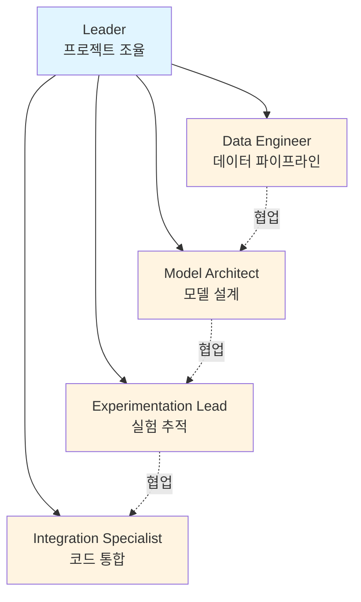
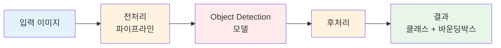
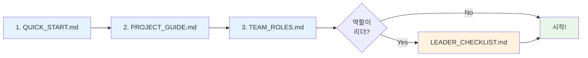
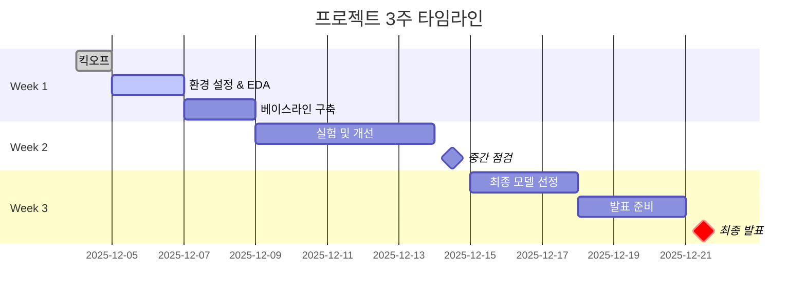
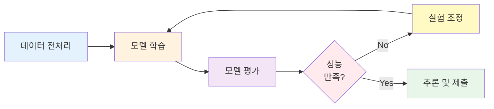

# 코드잇 8팀 초급 프로젝트 - 알약 이미지 인식 시스템

<div align="center">


**프로젝트 기간**: [시작일] ~ [종료일]

**팀명**: [팀명 추후 결정]

**프로젝트 목표**: 이미지 인식 기술을 활용한 알약 검출 및 분류 모델 개발

</div>

---

## 목차

1. [팀 소개](#팀-소개)
2. [프로젝트 개요](#프로젝트-개요)
3. [빠른 시작](#빠른-시작)
4. [프로젝트 구조](#프로젝트-구조)
5. [기술 스택](#기술-스택)
6. [실행 방법](#실행-방법)
7. [결과](#결과)
8. [팀 회고](#팀-회고)

---

## 팀 소개

### 팀 구조



### 팀원 및 역할

| 이름 | 역할 | 상태 | 주요 책임 | GitHub |
|:----:|:----:|:----:|----------|:------:|
| [이름] | **Leader** |  | 프로젝트 조율, 통합 | [@github] |
| [이름] | **Data Engineer** |  | 데이터 전처리, 증강 | [@github] |
| [이름] | **Model Architect** |  | 모델 설계, 구현 | [@github] |
| [이름] | **Experimentation Lead** |  | 실험 설계, 성능 개선 | [@github] |
| [이름] | **Integration & QA** |  | 코드 통합, 품질 관리 | [@github] |

---

## 프로젝트 개요

### 비즈니스 컨텍스트

> **헬스케어 스타트업 "헬스잇(Health Eat)"의 AI 엔지니어링 팀**으로서, 유저가 복용 중인 약 사진을 모바일 앱으로 촬영하면 해당 약의 정보를 자동으로 인식하는 시스템을 개발합니다.

### 시스템 아키텍처



### 기술적 과제

<table>
<tr>
<td width="50%">

**문제 유형**
- Object Detection
- Multi-class Classification
- Bounding Box Regression

</td>
<td width="50%">

**성능 목표**
- 최대 4개 알약 검출
- 높은 정확도 (mAP@50)
- 빠른 추론 속도

</td>
</tr>
</table>

### 데이터셋

| 항목 | 내용 |
|-----|------|
| **출처** | AI Hub 경구약제 이미지 데이터 |
| **훈련 데이터** | [X]개 이미지 |
| **검증 데이터** | [X]개 이미지 |
| **클래스 수** | [X]개 약품 |
| **평가 방법** | Kaggle Private Competition |

> **Note**
> 특정 데이터셋(TL_2_조합.zip, TS_2_조합.zip)은 사용 금지입니다.

---

## 빠른 시작

### 문서 읽기 순서



<details>
<summary><b>프로젝트 시작 가이드 (클릭하여 펼치기)</b></summary>

### 1. 필수 문서 읽기

프로젝트를 처음 시작하는 팀원은 다음 순서로 문서를 읽어주세요:

1. **[QUICK_START.md](QUICK_START.md)** - 빠른 시작 (5분)
2. **[PROJECT_GUIDE.md](PROJECT_GUIDE.md)** - 전체 프로젝트 가이드 (30분)
3. **[TEAM_ROLES.md](TEAM_ROLES.md)** - 팀 역할 및 책임 (15분)

**리더만 추가로**:
- **[LEADER_CHECKLIST.md](LEADER_CHECKLIST.md)** - 일일 체크리스트
- **[LEADERSHIP_ADVICE.md](LEADERSHIP_ADVICE.md)** - 리더십 실전 조언

### 2. 템플릿 활용

프로젝트 진행 시 다음 템플릿을 활용하세요:

| 템플릿 | 용도 | 작성 빈도 |
|--------|------|-----------|
| [협업 일지](templates/collaboration_log_template.md) | 개인 작업 기록 | 매일 |
| [실험 로그](templates/experiment_log_template.yaml) | 실험 설정/결과 | 실험마다 |
| [회의록](templates/meeting_notes_template.md) | 미팅 기록 | 미팅마다 |

</details>

<details>
<summary><b>개발 환경 설정 (클릭하여 펼치기)</b></summary>

### 환경 설정 단계

```bash
# 1. Repository 클론
git clone [repository-url]
cd [repository-name]

# 2. Python 가상환경 생성
conda create -n pill-detection python=3.8
conda activate pill-detection

# 또는 venv 사용
python -m venv venv
source venv/bin/activate  # Windows: venv\Scripts\activate

# 3. 의존성 설치
pip install -r requirements.txt

# 4. 데이터 다운로드
# [데이터 다운로드 가이드 추가 예정]
```

### 설치 확인

```bash
python -c "import torch; print(f'PyTorch: {torch.__version__}')"
python -c "import cv2; print(f'OpenCV: {cv2.__version__}')"
```

</details>

---

## 프로젝트 구조

### 타임라인



### 폴더 구조

<details>
<summary><b>전체 폴더 구조 보기</b></summary>

```
pill-detection/
│
├── 📖 문서 (Documentation)
│   ├── README.md                  # 이 파일
│   ├── QUICK_START.md             # 빠른 시작
│   ├── PROJECT_GUIDE.md           # 전체 가이드
│   ├── TEAM_ROLES.md              # 팀 역할
│   ├── LEADER_CHECKLIST.md        # 리더 체크리스트
│   ├── LEADERSHIP_ADVICE.md       # 리더십 조언
│   ├── CLAUDE.md                  # AI 가이드
│   └── SESSION_STATUS.md          # 현재 상태
│
├── 📝 템플릿 (Templates)
│   └── templates/
│       ├── collaboration_log_template.md
│       ├── experiment_log_template.yaml
│       └── meeting_notes_template.md
│
├── 💾 데이터 (Data) - Git 제외
│   ├── raw/                       # 원본 데이터
│   ├── processed/                 # 전처리된 데이터
│   └── augmented/                 # 증강 데이터
│
├── 📓 노트북 (Notebooks)
│   ├── 01_eda.ipynb               # 탐색적 데이터 분석
│   ├── 02_preprocessing.ipynb     # 전처리 실험
│   └── 03_visualization.ipynb     # 결과 시각화
│
├── 🧬 소스 코드 (Source Code)
│   ├── data/                      # 데이터 관련
│   │   ├── dataset.py
│   │   ├── preprocessing.py
│   │   └── augmentation.py
│   ├── models/                    # 모델 정의
│   │   ├── baseline.py
│   │   └── yolo.py
│   ├── training/                  # 학습 로직
│   │   ├── trainer.py
│   │   └── losses.py
│   ├── evaluation/                # 평가 로직
│   │   ├── metrics.py
│   │   └── visualize.py
│   └── utils/                     # 유틸리티
│       ├── config.py
│       └── logger.py
│
├── 🚀 실행 스크립트 (Scripts)
│   ├── train.py                   # 학습
│   ├── evaluate.py                # 평가
│   ├── inference.py               # 추론
│   └── make_submission.py         # Kaggle 제출
│
├── ⚙️ 설정 (Configs)
│   ├── baseline.yaml
│   └── experiment_*.yaml
│
├── 🧪 실험 (Experiments)
│   ├── exp_001/
│   ├── exp_002/
│   └── ...
│
├── 📊 문서 (Docs)
│   ├── DATA_ANALYSIS.md
│   ├── MODEL_SELECTION.md
│   ├── EXPERIMENTS.md
│   └── collaboration/             # 협업 일지
│
├── 🎤 발표 자료 (Presentation)
│   ├── slides.pptx
│   └── report.pdf
│
└── 📤 제출 (Submissions)
    └── submission_*.csv
```

</details>

### 폴더별 책임

| 폴더 | 주 담당자 | 설명 |
|------|----------|------|
| `data/` | Data Engineer | 데이터 전처리 파이프라인 |
| `models/` | Model Architect | 모델 아키텍처 정의 |
| `training/` | Model Architect | 학습 루프 및 손실 함수 |
| `evaluation/` | Experimentation Lead | 평가 지표 및 시각화 |
| `scripts/` | Integration Specialist | 실행 스크립트 |
| `experiments/` | Experimentation Lead | 실험 로그 관리 |
| `docs/` | Leader | 문서 통합 관리 |

---

## 기술 스택

<table>
<tr>
<td width="25%">

### 핵심 언어


</td>
<td width="25%">

### 딥러닝


</td>
<td width="25%">

### 실험 추적


</td>
<td width="25%">

### 협업


</td>
</tr>
</table>

<details>
<summary><b>전체 기술 스택 보기</b></summary>

### 프로그래밍 언어
- **Python 3.8+**

### 딥러닝 프레임워크
- PyTorch / TensorFlow (팀 선택)

### 데이터 처리
- NumPy
- Pandas
- OpenCV
- Pillow
- Albumentations

### 모델 개발
- Ultralytics (YOLO)
- torchvision
- Detectron2 (선택사항)

### 실험 추적
- Weights & Biases
- MLflow

### 협업 도구
- Git & GitHub
- Discord / Slack
- Notion / Google Docs

</details>

---

## 실행 방법

### 워크플로우



<details>
<summary><b>명령어 보기</b></summary>

### 데이터 전처리

```bash
python scripts/preprocess_data.py --input data/raw --output data/processed
```

### 모델 학습

```bash
# 베이스라인 학습
python scripts/train.py --config configs/baseline.yaml

# 특정 실험 설정으로 학습
python scripts/train.py --config configs/experiment_01.yaml
```

### 모델 평가

```bash
python scripts/evaluate.py --checkpoint experiments/exp_001/checkpoints/best.pt
```

### 추론 및 Kaggle 제출

```bash
# 추론
python scripts/inference.py \
    --checkpoint experiments/exp_001/checkpoints/best.pt \
    --input data/test

# 제출 파일 생성
python scripts/make_submission.py \
    --predictions outputs/predictions.json \
    --output submissions/submission_001.csv
```

</details>

---

## 결과

### 진행 상황

<div align="center">

| Week | Phase | 진행도 |
|:----:|:-----:|:------:|
| Week 1 | 기반 구축 |  |
| Week 2 | 실험 개선 |  |
| Week 3 | 완성 발표 |  |

</div>

<details>
<summary><b>실험 결과 요약</b></summary>

### 실험 로그

| Exp ID | Model | mAP@50 | Kaggle Score | Status | 비고 |
|:------:|-------|:------:|:------------:|:------:|------|
| exp_001 | YOLOv8n | 0.XXX | 0.XXX |  | Baseline |
| exp_002 | YOLOv8m | 0.XXX | 0.XXX |  | Larger model |
| exp_003 | YOLOv8m + Aug | 0.XXX | 0.XXX |  | Data augmentation |
| exp_004 | YOLOv8l | 0.XXX | 0.XXX |  | Final model |

### 최종 성능

| 지표 | 값 |
|-----|-----|
| **Validation mAP@50** | [X.XXX] |
| **Kaggle Public Score** | [X.XXX] |
| **Kaggle Private Score** | [X.XXX] |
| **최종 순위** | [X위 / 총 Y팀] |

### 주요 개선 사항

```diff
+ 개선 사항 1
+ 개선 사항 2
+ 개선 사항 3
```

</details>

---

## 팀 회고

<details>
<summary><b>Keep-Problem-Try 회고</b></summary>

### Keep (잘했던 점)

- [작성 예정]

### Problem (어려웠던 점)

- [작성 예정]

### Learn (배운 점)

- [작성 예정]

### Try (다음에 시도할 것)

- [작성 예정]

</details>

---

## 발표 자료

| 문서 | 링크 | 상태 |
|-----|------|------|
| 발표 슬라이드 | [slides.pptx](presentation/slides.pptx) |  |
| 최종 보고서 | [report.pdf](presentation/report.pdf) |  |

---

## 참고 자료

<details>
<summary><b>참고 링크 및 자료</b></summary>

### 데이터셋
- [AI Hub - 경구약제 이미지 데이터](링크)

### 논문 및 기술 자료
- [YOLO 공식 문서](https://docs.ultralytics.com/)
- [관련 논문 1]
- [관련 논문 2]

### 참고 프로젝트
- [유사 프로젝트 1]
- [유사 프로젝트 2]

</details>

---

## 라이선스

이 프로젝트는 교육 목적으로 작성되었습니다.

---

## 감사의 말

코드잇 멘토님, 주강사님, 그리고 팀원들에게 감사합니다.

---

<div align="center">

**마지막 업데이트**: 2025-12-04


**[위로 올라가기](#코드잇-8팀-초급-프로젝트---알약-이미지-인식-시스템)**

</div>
