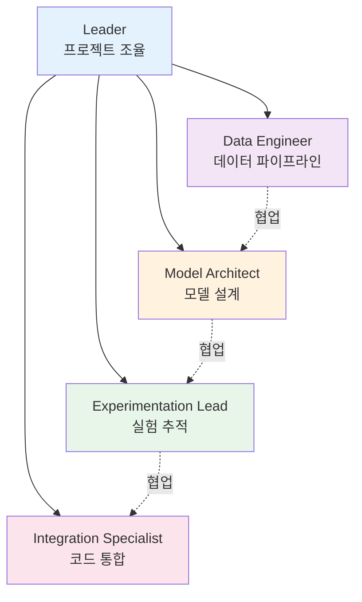
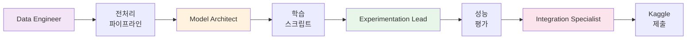
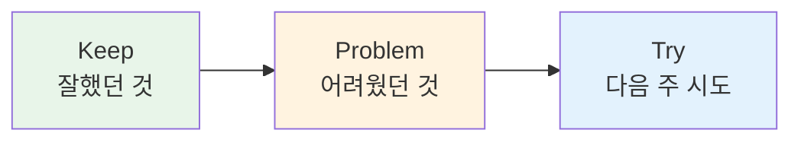
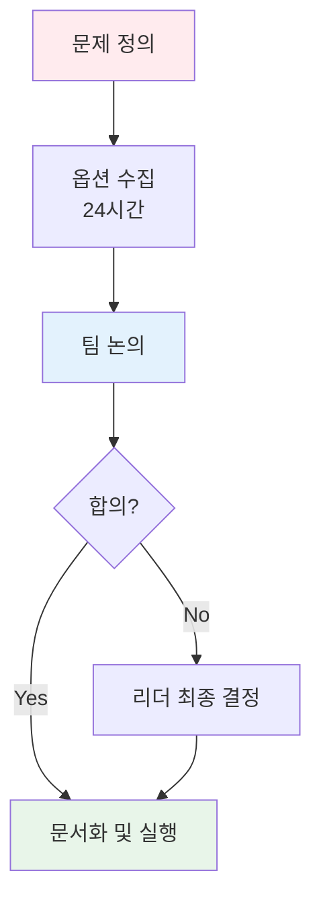
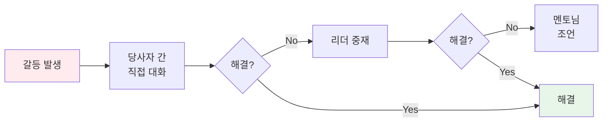

# 팀 역할 분배

<div align="center">


**5가지 역할로 프로젝트를 완성하세요**

</div>

---

## 팀 구조



---

## 역할 개요

<table>
<tr>
<th width="20%">역할</th>
<th width="30%">핵심 책임</th>
<th width="30%">주요 기술</th>
<th width="20%">작업 비중</th>
</tr>
<tr>
<td>

**Leader**


</td>
<td>
- 프로젝트 조율<br/>
- 의사결정 촉진<br/>
- 코드 통합<br/>
- 발표 준비
</td>
<td>
Git, 커뮤니케이션,<br/>
전체 아키텍처
</td>
<td>
조율: 40%<br/>
코딩: 40%<br/>
문서: 20%
</td>
</tr>
<tr>
<td>

**Data Engineer**


</td>
<td>
- EDA 주도<br/>
- 전처리 파이프라인<br/>
- 데이터 증강<br/>
- 데이터셋 관리
</td>
<td>
Python, Pandas,<br/>
OpenCV,<br/>
Albumentations
</td>
<td>
EDA: 30%<br/>
파이프라인: 50%<br/>
증강: 20%
</td>
</tr>
<tr>
<td>

**Model Architect**


</td>
<td>
- 모델 리서치<br/>
- 베이스라인 구축<br/>
- 아키텍처 설계<br/>
- Transfer Learning
</td>
<td>
PyTorch,<br/>
YOLO,<br/>
Pre-trained Models
</td>
<td>
리서치: 20%<br/>
구현: 60%<br/>
최적화: 20%
</td>
</tr>
<tr>
<td>

**Experimentation Lead**


</td>
<td>
- 실험 추적 시스템<br/>
- 하이퍼파라미터 튜닝<br/>
- 성능 평가<br/>
- 실험 문서화
</td>
<td>
W&B, MLflow,<br/>
Optuna,<br/>
Visualization
</td>
<td>
시스템 구축: 30%<br/>
실험: 50%<br/>
분석: 20%
</td>
</tr>
<tr>
<td>

**Integration Specialist**


</td>
<td>
- PR 리뷰<br/>
- 코드 통합<br/>
- 추론 파이프라인<br/>
- Kaggle 제출
</td>
<td>
Git, GitHub,<br/>
pytest,<br/>
Docker (선택)
</td>
<td>
리뷰: 40%<br/>
통합: 40%<br/>
제출: 20%
</td>
</tr>
</table>

---

## 주요 산출물

<details>
<summary><b>Leader</b></summary>

```
프로젝트 관리
├── 일일 스탠드업 주도
├── 코드 통합 관리
├── 발표 자료 조율
└── 최종 문서 통합
```

**파일**:
- README.md
- 발표 자료
- 통합 문서

</details>

<details>
<summary><b>Data Engineer</b></summary>

```
데이터 파이프라인
├── notebooks/01_eda.ipynb
├── src/data/preprocessing.py
├── src/data/augmentation.py
└── docs/DATA_ANALYSIS.md
```

**주요 작업**:
1. EDA 노트북 작성
2. 전처리 파이프라인
3. 데이터 증강 실험
4. 데이터 품질 관리

</details>

<details>
<summary><b>Model Architect</b></summary>

```
모델 구현
├── src/models/baseline.py
├── src/models/yolo.py
├── docs/MODEL_SELECTION.md
└── models/checkpoints/
```

**주요 작업**:
1. 모델 리서치 및 선정
2. 베이스라인 모델 구현
3. 아키텍처 개선
4. 최종 모델 최적화

</details>

<details>
<summary><b>Experimentation Lead</b></summary>

```
실험 관리
├── configs/*.yaml
├── experiments/
├── docs/EXPERIMENTS.md
└── 성능 분석 그래프
```

**주요 작업**:
1. 실험 추적 시스템 구축
2. 베이스라인 성능 평가
3. 다양한 실험 설계
4. 최종 성능 분석

</details>

<details>
<summary><b>Integration Specialist</b></summary>

```
통합 및 제출
├── scripts/inference.py
├── scripts/make_submission.py
├── README.md (실행 가이드)
└── 코드 리뷰 피드백
```

**주요 작업**:
1. Git 브랜치 전략
2. 추론 스크립트
3. PR 리뷰 및 통합
4. 최종 코드 정리

</details>

---

## 협업 매트릭스



<table>
<tr>
<th>작업</th>
<th>주 담당</th>
<th>협업 필요</th>
</tr>
<tr>
<td>EDA</td>
<td>Data Engineer</td>
<td>전체</td>
</tr>
<tr>
<td>전처리 파이프라인</td>
<td>Data Engineer</td>
<td>Model Architect</td>
</tr>
<tr>
<td>데이터 증강</td>
<td>Data Engineer</td>
<td>Experimentation Lead</td>
</tr>
<tr>
<td>모델 선정</td>
<td>Model Architect</td>
<td>Experimentation Lead</td>
</tr>
<tr>
<td>베이스라인 구현</td>
<td>Model Architect</td>
<td>Integration Specialist</td>
</tr>
<tr>
<td>실험 설계</td>
<td>Experimentation Lead</td>
<td>Model Architect</td>
</tr>
<tr>
<td>Kaggle 제출</td>
<td>Integration Specialist</td>
<td>Leader</td>
</tr>
<tr>
<td>발표 자료</td>
<td>Leader</td>
<td>전체</td>
</tr>
</table>

---

## 커뮤니케이션

### 일일 스탠드업

<table>
<tr>
<th width="30%">항목</th>
<th width="70%">내용</th>
</tr>
<tr>
<td><b>시간</b></td>
<td>매일 [팀 합의 필요] (예: 오전 10시)</td>
</tr>
<tr>
<td><b>소요 시간</b></td>
<td>15분</td>
</tr>
<tr>
<td><b>형식</b></td>
<td>
각자 3분씩:<br/>
1. 어제 한 일<br/>
2. 오늘 할 일<br/>
3. 막힌 부분 (Blocker)
</td>
</tr>
</table>

### 주간 회고



<table>
<tr>
<th>항목</th>
<th>내용</th>
</tr>
<tr>
<td><b>시간</b></td>
<td>매주 금요일 저녁 (1시간)</td>
</tr>
<tr>
<td><b>형식</b></td>
<td>KPT (Keep, Problem, Try)</td>
</tr>
</table>

### Discord/Slack 채널

```
#general           - 일반 대화
#daily-standup     - 스탠드업 기록
#code-review       - 코드 리뷰 요청
#experiments       - 실험 결과 공유
#questions         - 질문 및 논의
#random            - 잡담
```

---

## 의사결정 프로세스



<details>
<summary><b>의사결정 예시</b></summary>

**문제**: 어떤 Object Detection 모델을 사용할까?

**옵션**:
- A. YOLOv8 (빠름, 성능 준수)
- B. Faster R-CNN (느림, 성능 우수)

**논의**:
- A팀원: 시간이 부족하니 빠른 YOLOv8
- B팀원: 성능 우선이니 Faster R-CNN

**결정**:
- 베이스라인은 YOLOv8
- 시간 여유 있으면 Faster R-CNN 실험

**문서화**: docs/MODEL_SELECTION.md에 기록

</details>

---

## 역할 유연성

> 역할은 가이드라인일 뿐입니다. 서로 돕고 배우세요!

### Cross-Training 권장

<table>
<tr>
<th>역할</th>
<th>추가 학습 영역</th>
</tr>
<tr>
<td>Data Engineer</td>
<td>→ 데이터 증강 실험 (with Experimentation Lead)</td>
</tr>
<tr>
<td>Model Architect</td>
<td>→ 추론 스크립트 (with Integration Specialist)</td>
</tr>
<tr>
<td>Experimentation Lead</td>
<td>→ EDA 지원 (with Data Engineer)</td>
</tr>
<tr>
<td>Integration Specialist</td>
<td>→ 모델 이해 (with Model Architect)</td>
</tr>
</table>

### 역할 재조정

**재조정이 필요한 경우**:
- 업무량 불균형
- 개인 관심사 변경
- 예상치 못한 기술적 어려움

**재조정 프로세스**:
1. 문제 인지 → 2. 리더와 1:1 → 3. 팀 전체 논의 → 4. 역할 재분배

---

## 팀 규칙

### 약속

- [ ] 일일 스탠드업에 빠짐없이 참여
- [ ] 협업 일지를 매일 작성
- [ ] 질문은 주저하지 않고 즉시 공유
- [ ] 코드는 반드시 리뷰 후 병합
- [ ] 실패를 비난하지 않고 학습 기회로 전환
- [ ] 서로의 시간을 존중
- [ ] 즐겁게 프로젝트 진행

### 갈등 해결



---

## 팀원 정보

<table>
<tr>
<th width="20%">역할</th>
<th width="20%">이름</th>
<th width="30%">강점</th>
<th width="30%">GitHub</th>
</tr>
<tr>
<td>

**Leader**


</td>
<td>이진석</td>
<td>[첫 미팅 후 작성]</td>
<td>[@username]</td>
</tr>
<tr>
<td>

**Data Engineer**


</td>
<td>[이름]</td>
<td>[첫 미팅 후 작성]</td>
<td>[@username]</td>
</tr>
<tr>
<td>

**Model Architect**


</td>
<td>[이름]</td>
<td>[첫 미팅 후 작성]</td>
<td>[@username]</td>
</tr>
<tr>
<td>

**Experimentation Lead**


</td>
<td>[이름]</td>
<td>[첫 미팅 후 작성]</td>
<td>[@username]</td>
</tr>
<tr>
<td>

**Integration Specialist**


</td>
<td>[이름]</td>
<td>[첫 미팅 후 작성]</td>
<td>[@username]</td>
</tr>
</table>

---

## 최종 확인

**첫 팀 미팅에서 확인 필요**:

- [ ] 각자 역할 이해 및 동의
- [ ] 스탠드업 시간 합의
- [ ] 주간 회고 시간 합의
- [ ] 커뮤니케이션 채널 확정
- [ ] 의사결정 프로세스 이해
- [ ] 팀 규칙 동의

---

<div align="center">

**다음 단계**: 첫 팀 미팅에서 이 문서를 함께 읽고 수정/확정하기


</div>
